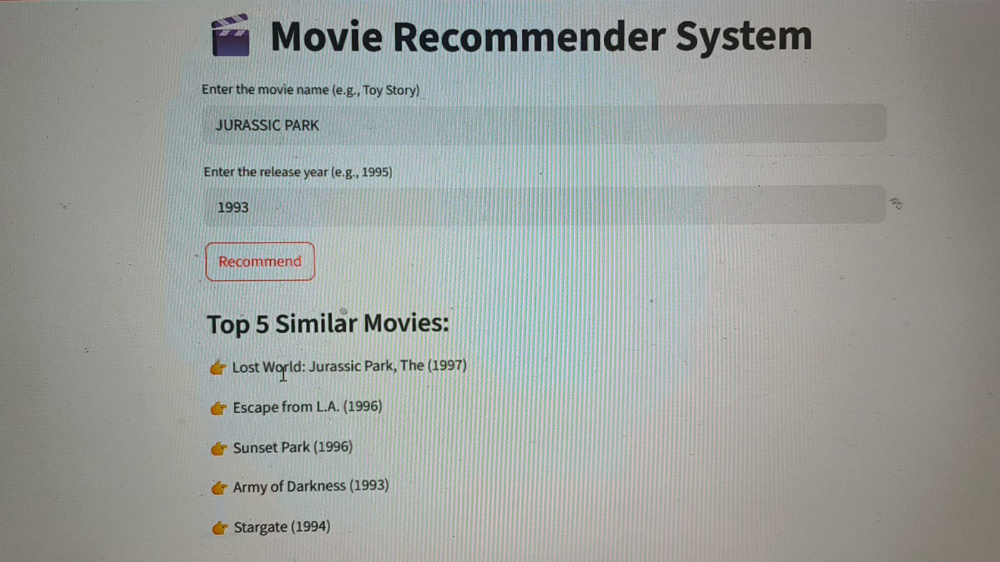

# 🎬 Movie Recommender System

This is a **content-based movie recommender system** built using Python and Streamlit.  
It recommends movies based on **genre and title similarity** using TF-IDF and Cosine Similarity.

---

## 📁 Dataset

We use the **MovieLens 100K dataset** (`ml-100k`), which contains metadata about movies and user ratings.  
Only the `u.item` file (movie metadata) is used here for content-based recommendations.

---

## 🚀 How It Works

1. Combines **movie title** and **genre** information.
2. Uses **TF-IDF Vectorization** to extract content-based features.
3. Calculates **cosine similarity** between all movie content vectors.
4. User inputs a movie name and release year (e.g., `"Copycat"`, `"1995"`).
5. System finds top 5 most similar movies.

## 📝 Google Colab Notebook

The data analysis, model building, and experimentation in the Google Colab notebook:  
[\[MovieRecommendationSystem.ipynb\]](https://colab.research.google.com/drive/1TdLUwAXSpnW-4roNa1LFtAJr7I3tuGLi?usp=sharing)

_____
## 🖥️ How to Run

### Prerequisites:
Install the required packages:

```bash
pip install -r requirements.txt
``` 

### Run the App:
Start the Streamlit app by running:

```bash
streamlit run app.py
```
---

## 📷 Demo Screenshot

 <!-- replace with actual path if different -->

---

## 🎥 Demo Video

[🎬 Watch the Demo](demo_video.mp4) <!-- replace with your actual video link (Google Drive, YouTube, etc.) -->

